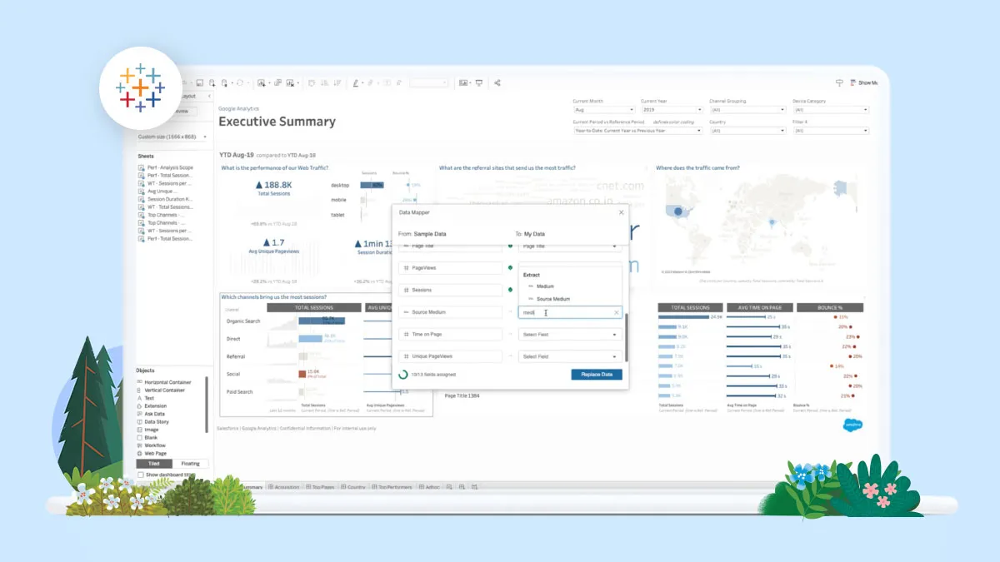

## Paint.NET

**Paint.NET** is a free graphic editor for Windows that combines simplicity with functionality. It offers advanced image editing features such as:

The program's interface is intuitive, making Paint.NET an excellent choice for both beginners and professionals who need a lightweight and fast application for graphic editing. The software is actively supported by the community and regularly updated, providing users with new features and improvements.

## To download Paint.NET from GitHub, simply follow these steps:

**1.** Click the download button on the Paint.NET GitHub page.

**2.** After clicking the button, you’ll see the download start in the top-right corner of your browser.

**3.** Once the download is complete, open the file to install Paint.NET on your computer.

**4.** Once installed, you will be able to edit your images with ease!

## Advantages of Paint.NET

1. **User-Friendly Interface**: Paint.NET has an intuitive and easy-to-use interface, making it accessible for beginners while offering advanced tools for professionals.

2. **Layer Support**: The software includes full support for layers, allowing for complex image compositions and easy editing of individual elements.

3. **Extensive Plugin Availability**: A wide range of plugins are available to extend functionality, from additional effects and tools to advanced features.

4. **Fast Performance**: Paint.NET is optimized for speed, ensuring smooth operation even on less powerful systems.

5. **Regular Updates**: The software is actively maintained with regular updates, providing users with new features, bug fixes, and improvements.

