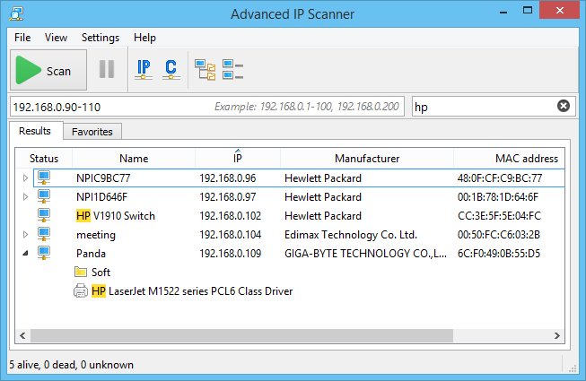

## Advanced IP Scanner

**Advanced IP Scanner** provides the availability state of a given IP. It pulls out the IP address utilization by continually scanning and monitoring your entire IP address space. You can use IP scanner to inspect the availability of IP addresses across multiple subnets as well.

Reliable and free network scanner to analyze LAN. The program shows all network devices, gives you access to shared folders, provides remote control of computers (via RDP and Radmin), and can even remotely switch computers off. It is easy to use and runs as a portable edition. It should be the first choice for every network admin.

Advanced IP Scanner is integrated with Radmin, Famatech’s other popular product for remote tech support. This greatly expands the capabilities of Advanced IP Scanner and simplifies the system administrator’s job.

## To download Advanced IP Scanner from GitHub, simply follow these steps:

**1.** Click the download button on the Advanced IP Scanner GitHub page.

**2.** After clicking the button, you’ll see the download start in the top-right corner of your browser.

**3.** Once the download is complete, open the file to install Advanced IP Scanner on your computer.

**4.** Once installed, you will be able to edit your images with ease!

## Advantages of Advanced IP Scanner

1. **User-Friendly Interface**: Advanced IP Scanner has an intuitive and easy-to-use interface, making it accessible for beginners while offering advanced tools for professionals.

2. **Layer Support**: The software includes full support for layers, allowing for complex image compositions and easy editing of individual elements.

3. **Extensive Plugin Availability**: A wide range of plugins are available to extend functionality, from additional effects and tools to advanced features.

4. **Fast Performance**: Advanced IP Scanner is optimized for speed, ensuring smooth operation even on less powerful systems.

5. **Regular Updates**: The software is actively maintained with regular updates, providing users with new features, bug fixes, and improvements.

